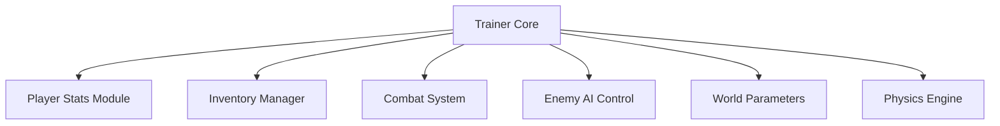

## Overview

**Terraria Trainer** is a runtime control utility designed to modify and manage core systems within **Terraria**. The trainer interfaces directly with player attributes, world mechanics, combat variables, and inventory logic. It allows controlled adjustment of health, mana, movement, item quantities, and NPC behavior without altering game files. Built for sandbox experimentation and system testing, the tool focuses on live parameter control and modular feature activation.

---

## Player Attribute Control Layer

* Health and mana value locking
* Infinite stamina and breath handling
* Defense and damage multiplier tuning
* Immunity state toggles

**Feature intent:**
Maintains fixed or dynamic player state values by intercepting runtime attribute updates.

---

## Inventory and Item Quantity Manager

* Item stack size override
* Unlimited consumable usage
* Instant item pickup handling
* Currency value control

**In-game behavior:**
Prevents item decrement events and enforces custom quantity thresholds during inventory transactions.

---

## Movement and Physics Adjustment

* Movement speed scaling
* Jump height and flight control
* Gravity toggle and fall damage disable
* Collision bypass options

**Feature intent:**
Alters physics calculations tied to player positioning and environmental interaction.

---

## Combat and Damage Systems

* One-hit kill enable/disable
* Weapon damage amplification
* Attack speed modification
* Critical hit enforcement

**In-game behavior:**
Overrides damage resolution logic before enemy health evaluation.

---

## Enemy and NPC Behavior Control

* Enemy freeze and despawn control
* NPC invulnerability toggles
* Spawn rate manipulation
* Aggression state locking

**Feature intent:**
Manages AI update cycles and spawn handlers for controlled encounter testing.

---

## World and Environment Parameters

* Time of day locking
* Weather state override
* Event trigger suppression
* Biome effect control

**In-game behavior:**
Forces static world states by bypassing environmental progression timers.

---

## Resource and Crafting Overrides

* Crafting without materials
* Instant crafting execution
* Recipe availability unlock
* Station requirement bypass

**Feature intent:**
Removes dependency checks during crafting validation routines.

---

## Internal System Architecture

---

## FAQ

**Does the trainer modify game files?**
No, all changes occur in memory during runtime.

**Can features be toggled individually?**
Yes, each system operates independently.

**Is the trainer session-based?**
All effects reset when the game is restarted.

**Does it affect world saves permanently?**
No permanent save data modifications are performed.

**Can multiple features run simultaneously?**
Yes, modules are designed for parallel operation.

**Is crafting logic fully bypassed?**
Only material and station checks are overridden, not recipe logic.

---

## Feature Summary

* Player stat locking systems
* Inventory and item quantity control
* Movement and physics modification
* Combat and damage management
* Enemy and NPC behavior control
* World state and environment overrides
* Crafting and resource bypass systems
